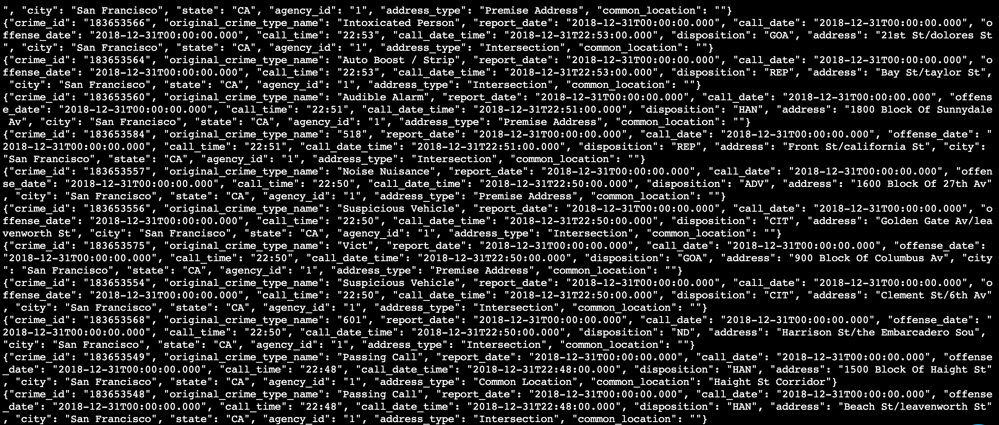
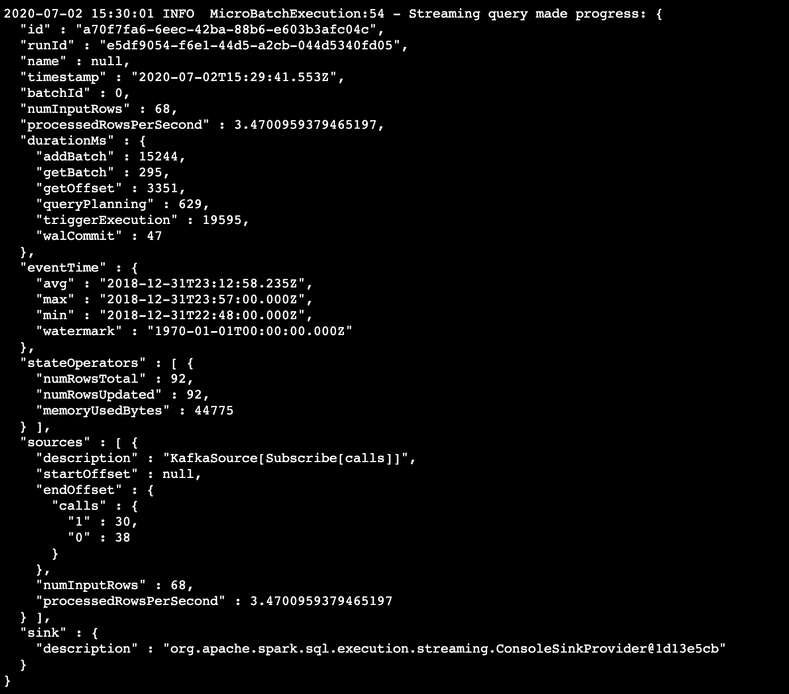
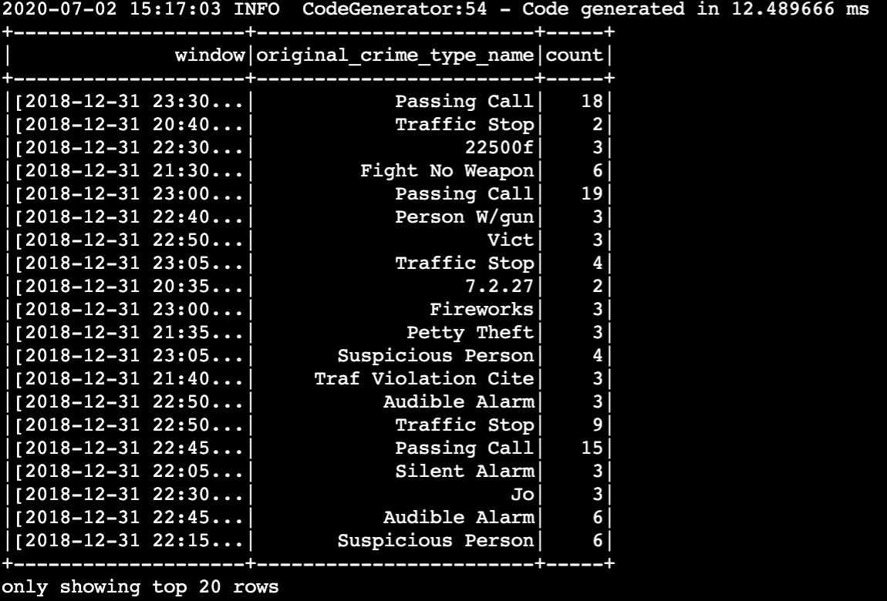

# SF Crime Statistics with Spark Streaming Project

## Introduction

In this project, you will be provided with a real-world dataset, extracted from Kaggle, on San Francisco crime incidents, and you will provide statistical analyses of the data using Apache Spark Structured Streaming. You will draw on the skills and knowledge you've learned in this course to create a Kafka server to produce data, and ingest data through Spark Structured Streaming.

You can try to answer the following questions with the dataset:

What are the top types of crimes in San Fransisco?
What is the crime density by location?

## Requirements

* Java 1.8.x
* Scala 2.11.x
* Spark 2.4.x
* Kafka
* Python 3.6 or above

## Environment

* Install requirements using `./start.sh` if you use conda for Python. If you use pip rather than conda, then use `pip install -r requirements.txt.`

* Use the commands below to start the Zookeeper and Kafka servers. You can find the bin and config folder in the Kafka binary that you have downloaded and unzipped.

  - `bin/zookeeper-server-start.sh config/zookeeper.properties`
  - `bin/kafka-server-start.sh config/server.properties`

## Step 1

* The first step is to build a simple Kafka server.

* Complete the code for the server in `producer_server.py` and `kafka_server.py`.

* You can insert data into topic using this Python command: `python kafka_server.py`.

* To see if you correctly implemented the server, use the command `bin/kafka-console-consumer.sh --bootstrap-server localhost:9092 --topic "calls" --from-beginning` to see your output.

* Screenshot of kafka-consumer-console output:

## Step 2

* Apache Spark already has an integration with Kafka brokers, so we would not normally need a separate Kafka consumer. However, we are going to ask you to create one anyway. Why? We'd like you to create the consumer to demonstrate your understanding of creating a complete Kafka Module (producer and consumer) from scratch. In production, you might have to create a dummy producer or consumer to just test out your theory and this will be great practice for that.

* Do a spark-submit using this command: `spark-submit --packages org.apache.spark:spark-sql-kafka-0-10_2.11:2.3.4 --master local[*] data_stream`.

* Screenshot of  progress reporter after executing a Spark job:

* Screenshot of the Spark Streaming UI as the streaming continues:

## Step 3
The answers to these questions:

* How did changing values on the SparkSession property parameters affect the throughput and latency of the data?

**Increasing the spark.driver cores and memory and/or the spark.executor cores and memory is a good way.**

* What were the 2-3 most efficient SparkSession property key/value pairs? Through testing multiple variations on values, how can you tell these were the most optimal?

**I saw at http://spark.apache.org/docs/latest/configuration.html#viewing-spark-properties and reading here trying to use some key-values related to optimize Spark combined with Kafka, and the best key-value for me was: spark.default.parallelism, spark.sql.shuffle.partitions and spark.streaming.kafka.maxRatePerPartition**
